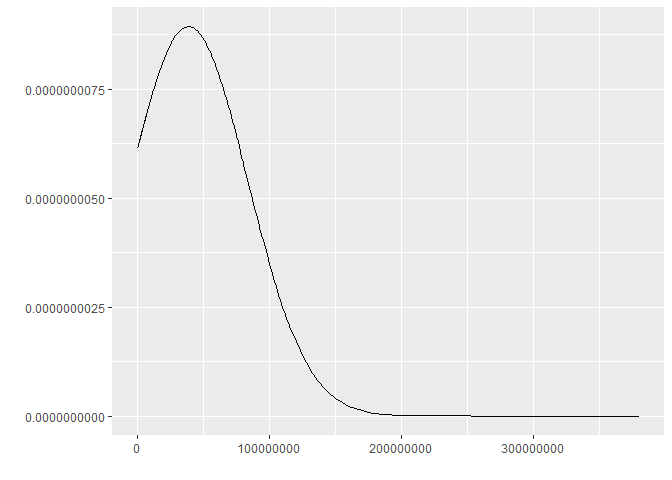
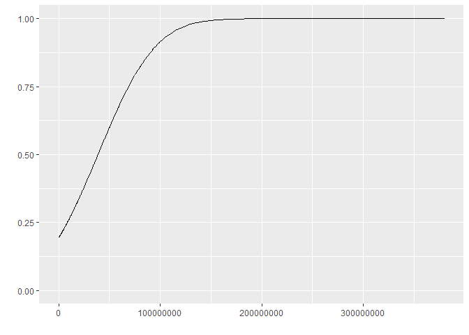

Untitled
================
2022-08-16

``` r
library(dplyr)
```

    ## Warning: package 'dplyr' was built under R version 4.1.3

    ## 
    ## Attaching package: 'dplyr'

    ## The following objects are masked from 'package:stats':
    ## 
    ##     filter, lag

    ## The following objects are masked from 'package:base':
    ## 
    ##     intersect, setdiff, setequal, union

``` r
library(tidyr)
```

    ## Warning: package 'tidyr' was built under R version 4.1.3

``` r
library(ggfortify)
```

    ## Warning: package 'ggfortify' was built under R version 4.1.3

    ## Loading required package: ggplot2

    ## Warning: package 'ggplot2' was built under R version 4.1.3

``` r
#disable Scientific notation 
options(scipen = 999)
```

``` r
Movies=mutate(Movies,"do people really mess with it like that "=dense_rank(vote_average))
```

``` r
Movies$releasedate2=Movies$release_date%>%as.character()
```

``` r
t=separate(Movies,releasedate2,c("date","year"),"-")
```

    ## Warning: Expected 2 pieces. Additional pieces discarded in 9980 rows [1, 2, 3,
    ## 4, 5, 6, 7, 8, 9, 10, 11, 12, 13, 14, 15, 16, 17, 18, 19, 20, ...].

``` r
bigmovie=cbind(t$date,Movies)
#merge by title 
#rename variable to merge 
names(bigmovie)[5]= "title"
biggestmovie=merge(bigmovie,moviemoney,"title")
```

``` r
#cleaned biggest movie to remove unnecessary data
names(biggestmovie)[2]="year"
biggestmovie$overview=NULL
biggestmovie$title...7=NULL
biggestmovie$id=NULL

#rename variable to merge 
names(bigmovie)[5]= "title"
```

``` r
biggestmovie$"1910s"=ifelse(biggestmovie$year<1920 & biggestmovie$year>=1910,1,0)
length(which(biggestmovie$`1910s`== 1))
```

    ## [1] 2

``` r
biggestmovie$"1920s"=ifelse(biggestmovie$year<1930 & biggestmovie$year>=1920,1,0)
length(which(biggestmovie$`1920s`== 1))
```

    ## [1] 3

``` r
biggestmovie$"1930s"=ifelse(biggestmovie$year<1940 & biggestmovie$year>=1930,1,0)
length(which(biggestmovie$`1930s`== 1))
```

    ## [1] 12

``` r
biggestmovie$"1940s"=ifelse(biggestmovie$year<1950 & biggestmovie$year>=1940,1,0)
length(which(biggestmovie$`1940s`== 1))
```

    ## [1] 15

``` r
biggestmovie$"1950s"=ifelse(biggestmovie$year<1960 & biggestmovie$year>=1950,1,0)
length(which(biggestmovie$`1950s`== 1))
```

    ## [1] 26

``` r
biggestmovie$"1960s"=ifelse(biggestmovie$year<1970 & biggestmovie$year>=1960,1,0)
length(which(biggestmovie$`1960s`== 1))
```

    ## [1] 65

``` r
biggestmovie$"1970s"=ifelse(biggestmovie$year<1980 & biggestmovie$year>=1970,1,0)
length(which(biggestmovie$`1970s`== 1))
```

    ## [1] 105

``` r
biggestmovie$"1980s"=ifelse(biggestmovie$year<1990 & biggestmovie$year>=1980,1,0)
length(which(biggestmovie$`1980s`== 1))
```

    ## [1] 233

``` r
biggestmovie$"1990s"=ifelse(biggestmovie$year<2000 & biggestmovie$year>=1990,1,0)
length(which(biggestmovie$`1990s`== 1))
```

    ## [1] 572

``` r
biggestmovie$"2000s"=ifelse(biggestmovie$year<2010 & biggestmovie$year>=2000,1,0)
length(which(biggestmovie$`2000s`== 1))
```

    ## [1] 1439

``` r
biggestmovie$"2010s"=ifelse(biggestmovie$year<2020 & biggestmovie$year>=2010,1,0)
length(which(biggestmovie$`2010s`== 1))
```

    ## [1] 1056

``` r
biggestmovie$"2020s"=ifelse(biggestmovie$year<2027 & biggestmovie$year>=2020,1,0)
length(which(biggestmovie$`2020s`== 1))
```

    ## [1] 20

``` r
biggestmovie$gross=biggestmovie$revenue - biggestmovie$budget
```

``` r
ggdistribution(dnorm,x = biggestmovie$budget,mean = mean(biggestmovie$budget),sd = sd(biggestmovie$budget))
```

<!-- -->

``` r
max(biggestmovie$budget)
```

    ## [1] 380000000

``` r
moviesubmax=as.data.frame(biggestmovie%>%slice_min(budget,n=3038))
```

``` r
ggdistribution(pnorm,x = biggestmovie$budget,mean = mean(biggestmovie$budget),sd = sd(biggestmovie$budget))
```

<!-- -->
